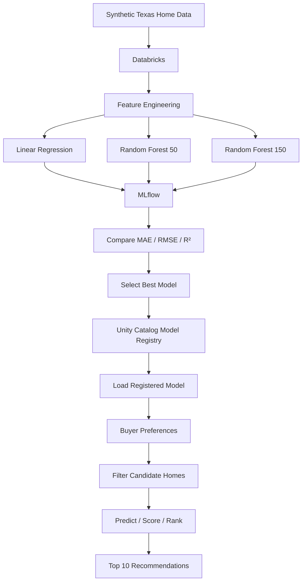

# Texas Home Finder — Databricks + MLflow

End-to-end demo notebook that generates synthetic Texas housing data, trains and
compares multiple regression models with MLflow experiment tracking, registers the
best model to the Unity Catalog Model Registry, and uses it to rank candidate homes
against a buyer's preferences.

> The housing data is synthetic. Do not use the resulting rankings for real
> purchasing decisions.

## Project structure

```
.
├── Texas_home_mlflow_databricks.ipynb   # main notebook (all steps below)
├── databricks.yml                        # Databricks Asset Bundle config (target: dev)
├── pyproject.toml                        # project deps, managed by uv
├── uv.lock                               # locked dependency versions
├── .databricks/                          # VS Code extension state (git-ignored)
│   ├── .databricks.env                   # local env vars injected into notebook kernel
│   └── bundle/dev/                       # bundle target overrides (serverless compute, etc.)
└── mlflow.db                             # local sqlite store used by mlflow (git-ignored)
```

## Architecture



**Notebook flow:**

1. Generate 1,000 synthetic Texas homes (city, price, sqft, bedrooms, school
   rating, commute time, etc.).
2. Persist the raw data to a Unity Catalog table.
3. Train three candidate models (linear regression, two random forests) and
   log params/metrics/artifacts for each as separate MLflow runs.
4. Pick the model with the lowest MAE and log it as the "best" run.
5. Register that model version in the Unity Catalog Model Registry.
6. Load the registered model, filter homes against a sample buyer profile,
   score/rank them, and write the recommendations back to Unity Catalog.

## Prerequisites

- **Databricks workspace** with Unity Catalog enabled, and permission to create
  (or use an existing) catalog/schema.
- **Python 3.12** (pinned via `requires-python` in `pyproject.toml`).
- **[uv](https://docs.astral.sh/uv/)** for dependency management — the project's
  virtual environment and lockfile (`uv.lock`) are managed by it.
- **[Databricks CLI](https://docs.databricks.com/dev-tools/cli/index.html)**
  authenticated against the target workspace (`databricks auth login` or a
  profile in `~/.databrickscfg`) — used for one-off admin tasks like creating
  catalogs/schemas and grants.
- **VS Code** with the **Databricks extension** installed and signed in to the
  same workspace — this is what makes `spark` and `dbutils` available inside
  the notebook kernel (see below).
- Unity Catalog privileges on the target catalog/schema:
  `USE_CATALOG`, `USE_SCHEMA`, `CREATE_TABLE`, `CREATE_MODEL`, `SELECT`,
  `MODIFY`.

## Running via Databricks Connect from VS Code

This project does **not** run on a Databricks cluster directly — it runs
**locally**, with the notebook's `spark` session transparently proxied to the
workspace over **Databricks Connect** (Spark Connect). This lets you edit and
execute the notebook in VS Code's normal Jupyter UI while all Spark/SQL/Unity
Catalog operations actually execute in the cloud workspace.

How it's wired up:

1. **`databricks.yml`** defines a Databricks Asset Bundle with a `dev` target
   pointing at the workspace host. The Databricks VS Code extension uses this
   file to know which workspace to connect to.
2. Signing in via the extension (Databricks icon in the VS Code sidebar →
   "Configure workspace") creates **`.databricks/`**, which holds:
   - `.databricks.env` — environment variables (host, auth type, a local
     metadata-service URL, bundle target, serverless compute id) that get
     injected into the notebook kernel's process automatically.
   - `bundle/dev/vscode.overrides.json` — local-only overrides (e.g.
     `"serverless": true`, auth profile) that don't get committed.
3. Because `DATABRICKS_AUTH_TYPE=metadata-service` and
   `DATABRICKS_SERVERLESS_COMPUTE_ID=auto` are set, opening the notebook and
   running a cell that references `spark` connects, via Spark Connect, to a
   **serverless** compute resource in the workspace under your own identity
   (no cluster to start/stop manually).
4. `databricks-connect` (declared in `pyproject.toml`, resolved by `uv`) is the
   client library that implements this — it's a drop-in `pyspark`-compatible
   API, so notebook code reads like ordinary PySpark/SQL even though nothing
   runs on your machine except the Python driver process.
5. `mlflow` in the notebook talks directly to the workspace's MLflow tracking
   server / Unity Catalog registry over its own REST connection — independent
   of the Spark Connect session, but authenticated the same way.

**One-time setup:**

```bash
uv sync                       # create the venv and install pinned deps
databricks auth login         # authenticate the CLI (used for admin tasks)
```

Then in VS Code:

1. Install the **Databricks** extension.
2. Command palette → **Databricks: Configure workspace**, select/enter the
   workspace host from `databricks.yml`, and sign in.
3. Open `Texas_home_mlflow_databricks.ipynb`, pick the project's `.venv` as
   the Jupyter kernel, and run cells top to bottom.

## Unity Catalog target

The notebook's Configuration cell defines where data and models land:

```python
CATALOG = "texas"
SCHEMA  = "housingdata"
```

`texas.housingdata` is a dedicated catalog/schema created for this project
(rather than reusing a shared `main`/`default`, which may not exist or be
writable in every workspace). It holds:

- `texas.housingdata.texas_homes` — the raw synthetic housing data.
- `texas.housingdata.texas_home_price_model` — the registered model.
- `texas.housingdata.texas_home_recommendations` — the final ranked output.

If you point this at a different workspace, update `CATALOG`/`SCHEMA` (and
confirm the relevant Unity Catalog privileges) before running the notebook.

## Notes

- `mlflow.set_registry_uri("databricks-uc")` is set early, in the Configuration
  cell, so MLflow resolves the Unity Catalog registry directly instead of
  probing the Spark session for a registry URI config — that probe isn't
  supported over Spark Connect and otherwise floods stderr with harmless but
  noisy GRPC error logs.
- `.databricks/` is git-ignored (it's local VS Code extension state tied to
  this machine/workspace pairing). `mlflow.db` (the local MLflow sqlite store)
  and `.venv/` are not currently ignored — add them to `.gitignore` if you
  start versioning this project.
